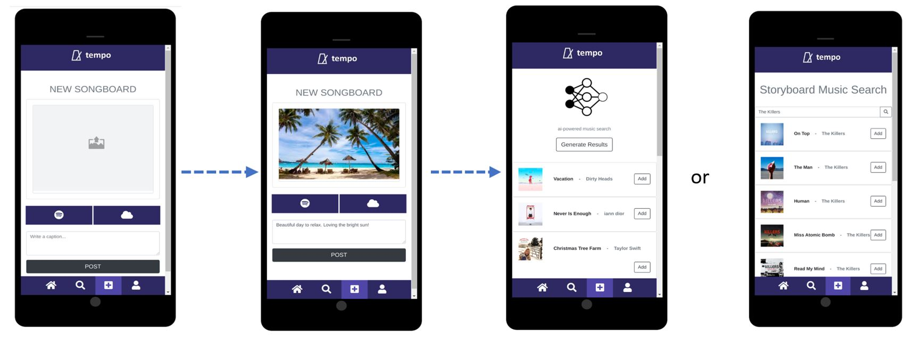
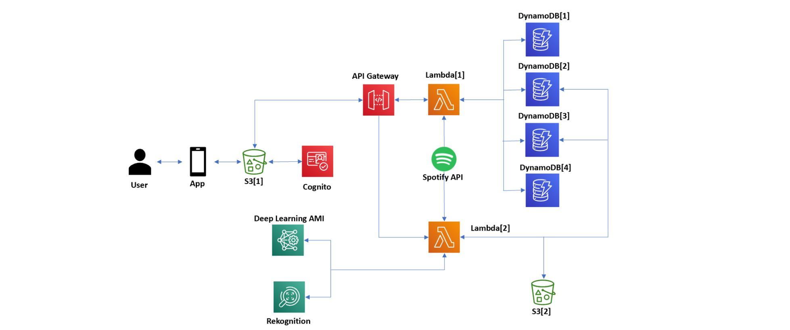
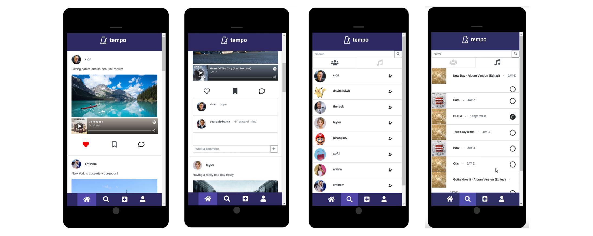
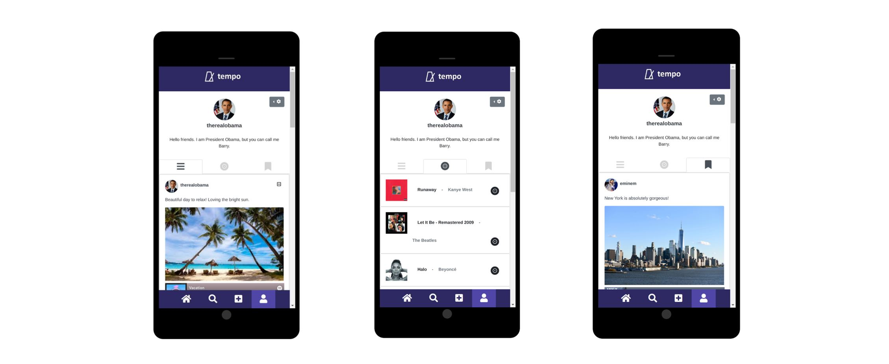

# Tempo: an AI driven Image-to-music Social Media Platform

Contributors: Jerry Zhang, Wenhao Li
Video Demo: https://www.youtube.com/watch?v=epbASCz5dwc&feature=youtu.be

Utilizing AWS’s microservices and serverless architecture, we aimed to develop a unique social media app—tempo, that takes advantage of both novel advancements in cloud computing and machine learning. With tempo, users are able to create, share, and save storyboards—image, music, and content driven posts. The app offers a platform for users to explore their own creativity as well as take advantage of AI technologies in image classification and NLP to match songs to their respective storyboards. 

From the upload page, users can create and customize their own storyboard with whatever image, caption, and music they’d like. They can add their own desired music via the spotify button or add music found via our rekognition/comprehend backend. 

Note that the rekognition backend utilizes the image as the main format the extract labels while comprehend uses the text currently within the caption to extract relevant labels. Together, we have a corpus of labels that we search and append songs to within the music search for the AI music search

The following figure illustrates the application’s architecture and how the AWS services and Spotify API are integrated with our frontend that is hosted on S3.

The following figure shows the home/newsfeed and search tabs. On the newsfeed, users will be able to scroll through and view the storyboards of themselves and the other users they may follow in the order that they were posted. Additionally, with each storyboard, users can like, bookmark, and comment on them. All the aforementioned options will be stored within the StoryId DynamoDB.

There are two main navigation sections of the search page. The first navigation tab allows users to search for other users on the platform and subsequently follow them in order to see their posts. The second navigation tab allows users to look up music via the Spotify API and then also save songs to their saved song section in their user page.

The last navigation bar is the user profile page, which is shown below. From this page users can view or delete their own posts, view their saved music, and view their saved posts.

The following figure shows the user flow from signup to login. 

Spotify API: https://github.com/steinitzu/spotify-api
